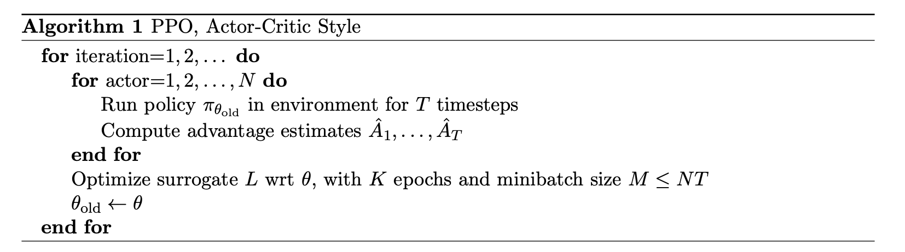

## Introduction

Deepest 시즌 8 리크루팅 문제입니다.

이 코드는 저자가 1년 전에 OpenAI gym의 대표문제인 CartPole를 [PPO](https://arxiv.org/pdf/1707.06347.pdf)로 풀기위해서 짰던 코드입니다.

  </img>

에서 N=1 인 특수한 상황에 대한 구현을 하려고 하였으나... 구현이 잘못되어서 학습이 되지 않는 상황입니다.
버그를 수정하여 구현을 마무리하고 최고의 optimizer를 골라주세요!

### 환경설정

1. `pip install -r requirements.txt` 를 실행합니다.

  
## Tasks

### 1. 코드 완성 (총 6점)

모든 버그를 수정하여 PPO 구현을 완성하는 것이 목표입니다.

- 여기서 버그란 구현해야 하는 부분을 빼먹고 구현을 안하였거나, 잘못 구현한 부분들을 뜻합니다.
- 버그를 수정할 때는 왜 해당 부분이 버그인지에 대한 이유와 어떻게 고쳤는지, 왜 그렇게 고쳤는지를 레포트에 명시해주세요.

※ 이 단계에서 `main.py` 는 수정할 필요가 없습니다.
  

### 2. Save, Load, Play 구현 (총 3점)

Save, Load, Play 기능을 구현해주세요.

- Save는 주어진 경로에 현재 학습 상황을 저장하는 것입니다. 무엇을 저장해야 할지는 잘 판단해 주세요.
- Load는 Save에서 저장한 학습 상황을 불러오는 것입니다. 불러온 후 이어서 학습하거나 Play하는것이 가능해야 합니다.
- Play는 저장된 학습 상황에 대해 evaluation을 진행하는 것입니다. 즉 학습이 완료된 모델을 사용해 새로운 에피소드를 몇번 진행하고, 점수가 어떻게 나오는지 기록하는 코드를 추가해주시면 됩니다.
- 본 항목에 대해서는 별도의 레포트는 필요가 없습니다. 하지만 특별히 기술할 점이 있으면 적어주세요.
  

### 3. Evaluation (총 6점)

본 코드의 모델에는 5가지의 optimzer 옵션이 있습니다. 각 optimizer를 사용한 결과를 비교 분석하여 본 문제를 해결하는데 있어서 최적의 optimizer를 골라주세요!

- 비교 분석 과정을 상세하게 레포트에 적어주세요.
- 무엇을 비교/분석할지는 완전히 자유입니다. 꼭 어떤것이 **수치적으로 완벽하게 우위!** 라는것을 끌어낼 필요는 없습니다.
- 당연하지만 이 항목을 풀 때는 코드를 마음껏 수정해주세요.
- CartPole은 gym 환경들 중 가장 간단한 환경입니다. 이 때문에 방법에 따른 차이가 너무 적어 보일 수 있으나, 매우 어려운 문제라는 관점에서 접근해 주세요.
- 분석한 것을 설명할 때, 그리고 직접 분석할 때에도 그래프를 사용하는 것이 효과적일 수 있습니다. (필수는 아닙니다 :D) 그래프를 그리는 것이 익숙하지 않으시면 [여기](https://pytorch.org/tutorials/recipes/recipes/tensorboard_with_pytorch.html)를 참고해 주세요.
- 정답이나 모범답안을 정해놓지 않은 문제입니다. 합당하고 논리적인 과정만 있으면 됩니다.
